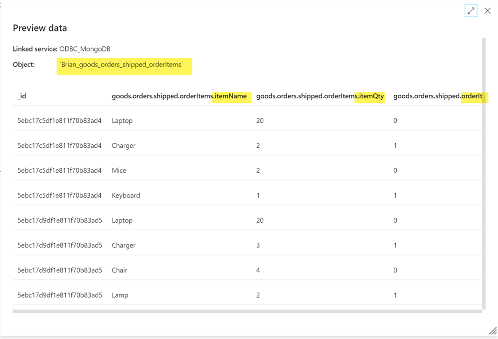
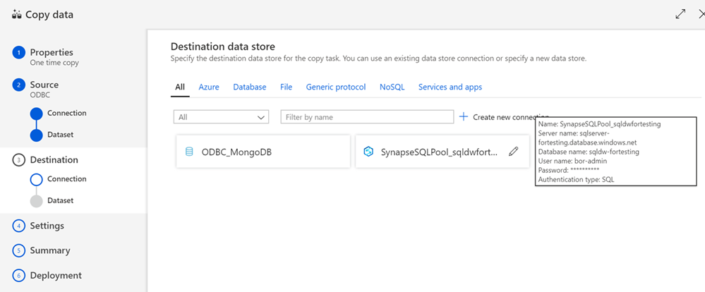

# Using the Azure Data Factory ODBC Connector to Flatten Documents from MongoDB

May 2020 

## Overview 

In Azure Data Factory (ADF), there is a native MongoDB connector. However, [Microsoft documentation states](https://docs.microsoft.com/en-us/azure/data-factory/connector-mongodb) that the connector only supports up to MongoDB 3.4. To enable connectivity to a later version, the [ODBC connector](https://docs.microsoft.com/en-us/azure/data-factory/connector-odbc) must be used. 

One of the benefits of using this approach is that the document data, which can be deeply nested, appears in a flattened table structure. This more easily allows it to be used with a relational data sink. 

## Resources 

### ARM Template 
The template is available [here](arm_template_ADF_ODBC/arm_template.json)

### Dataset 
The `Brian` dataset is available [here](Brian.json). 

## Steps 
- [ ] Install the MongoDB Connector for BI
- [ ] Install the MongoDB ODBC Driver 
then 
- [ ] Create an ODBC Linked Server in Azure Data Factory 
- [ ] Create a pipeline using an ODBC source and Azure Synapse Analytics SQL Pool sink 
or 
- [ ] Create a ForEach loop with a Copy Data activity using an ODBC source and Azure Synapse Analytics SQL Pool sink 

## Connecting to MongoDB 3.4+ 
Connecting to MongoDB via the ODBC connector requires multiple steps because its document storage must be translated into relational storage to be used with a relational data store, such as Azure SQL Database, Azure Synapse Analytics, or PowerBI. 

You can find full details in the [MongoDB BI Connector Quick Start Guide](https://docs.mongodb.com/bi-connector/current/local-quickstart/). There are three main components. 
- On the system MongoDB is installed on, the MongoDB Connector for BI - essentially a translation layer - must be installed. Then the mongosqld service must be started. 
- In the Azure Data Factory self-hosted integration runtime VM, the MongoDB ODBC Driver for BI Connector is installed. After that, a system DSN pointing to the ODBC driver is created. 
- In the data factory, create a linked service connection to the DSN. 

### Installing the MongoDB Connector for BI 

I am using a test database that has several documents in it. The document `Brian` has several objects, whith various levels of nesting. 

 

The first step is to download and install the [MongoDB Connector for BI](https://www.mongodb.com/download-center/bi-connector) on the MongoDB server. 

In my example, I have a Windows Server 2019 Datacenter VM running MongoDB v4.0.18. 

 

I have downloaded and installed the BI Connector. To run it, I start the mongosqld.exe process from the command line. 

 

### Installing and Testing the MongoDB ODBC Driver 

The next step is to [install a self-hosted integration runtime](https://docs.microsoft.com/en-us/azure/data-factory/create-self-hosted-integration-runtime) for the Azure Data Factory, and install the MongoDB ODBC driver on the same VM.

 

After I connect to the VM, I can use the Microsoft Integration Runtime Configuration Manager to confirm the node is connected. 

The appropriate [MongoDB ODBC driver](https://github.com/mongodb/mongo-odbc-driver/releases/) needs to be installed on the same server as the self-hosted integration runtime. 

When that is installed, a [System DSN must be created for the MongoDB ODBC connection](https://docs.mongodb.com/bi-connector/current/tutorial/create-system-dsn/). 

### Testing the connection

Using the Microsoft Integration Runtime Configuration Manager, you can test the connection by doing the following:

1. Start the Configuration Manager
2. Click on the **Diagnostics** tab
3. Under **Test Connection**, select *ODBC*
4. Enter a connection string in the format `dsn=SystemDSNName`
5. Choose the authentication method
6. Click test!

 

## Using the ODBC Linked Service in Azure Data Factory 

With the DSN in place, an ODBC connection can now be set up in Azure Data Factory. Open your Data Factory, and from the menu on the left select the Manage icon. Under Cnnections, select Linked services. Select + New. 

The Data store will be ODBC. 

Fill out the information in New linked service. The important things to note are that the self-hosted integration runtime must be selected, and the connection string will be to the *DSN*, not to the MongoDB. If the connection test is successful, create the service. 

Next, set up a Dataset that will use the linked service. Go the Author icon, click the ... to the right of Datasets, and select *New datase*t. Go to the Connection tab and select the ODBC Linked service you created. 

Here is where you will see the "flattening" of the document data occurring. 

First, let's examine an object from the document in depth. There is the top-level object, which will be seen as the name of the document, `Brian`, in the dataset. There are several objects within it - `satellites`, `customers`, and `orders`. 

When you select the ODBC linked service, the list of "tables" populates with the nested objects - in this example, the `satellites`, `customers`, and `orders`. 

If you choose one of the tables and select *Preview data*, you can verify that the "columns" in the "table" line up with the nested elements of the object. 

To use the ODBC linked service, go to the *Author* icon, click the ... to the right of Pipelines, and select *New pipeline*. 

Add a Copy data task to the pipeline. On the Source tab, for the Source dataset, select the ODBC dataset you created. If you want to verify the data is correct, you can use the Preview data button. 

On the Sink tab, for the Sink dataset, select the appropriate dataset you have created (or make a new one). In my example, I have a Synapse Analytics SQL Pool that I will be inserting the data into. 

You can Debug the pipeline to test the execution. 

After a successful execution, I am able to connect to my Synapse Analytics SQL Pool and view the data in the table. 

As you can see if you go back to the Connection tab for the ODBC dataset, there is one "table" listed for each object in the document. To add all of them to your relational data store, you would need a dataset and *Copy data task* for each. 

 

This approach can be used for small or static data sets, but doesn't scale well. 

### Creating a ForEach loop with a Copy Data activity to handle multiple objects 

You'll use the Copy Data wizard to select two or more objects from the document and select two (or more) sinks for them. 

The first step is to create the linked services, as shown above. 

The second step is to connect to your relational data store and create two sink tables that match the schema of the document objects. 

> :warning: This will only need to be done for the two tables you're using to set up your framework - after the pipeline is created and parameterized, future tables will be created automatically.

Here, I have created tables for the top-level customer object (`Brian`) and the order items. ([Design tables using Synapse SQL](https://docs.microsoft.com/en-us/azure/synapse-analytics/sql/develop-tables-overview))

Go to the Data Factory overview window and click on the `Copy Data` task. This will open the wizard. On the *Properties* window, enter an appropriate task name and description. Choose to run once. Click *Next*. 

On the Source data store window, select the ODBC linked service. Click *Next*. 

 

On the Select tables window, choose the document objects you defined the schema for in the SQL Pool. Click *Next*. 

 

On the Apply filter window, you can add a timeout or additional columns if needed. Click *Next*. 

On the Destination data store window, select the SQL Pool linked service. Click *Next*. 

On the Table mapping window, match up the object from the document with the table you created in the SQL Pool. Click *Next*. 

On the Column mapping window, for each `Source` column, select the appropriate `Destination` column. Click *Next*. 

On the Settings window, uncheck *Enable staging*. Set the Copy method to *Bulk Insert*. Click *Next*. 

Review the information on the Summary screen. I like to Edit the `Source` and `Destination` dataset names so that when I view them in the list later, I know which pipeline they are for. Click *Next*. 

 

The pipeline will be validated and you should see a Deployment complete window. Click *Edit pipeline*. 

 

What you see now is a `ForEach` loop with one activity inside it. If you want to explore this activity further, click the pencil to the right of it. 

 

## Using the data in the Synapse Analytics SQL Pool 

The data is now converted from a nested document structure to a table. These tables in the Synapse Analytcis SQL Pool can be joined together for meaningful relational queries. 

Here, I've joined the customer information (`Brian`) with the order information. 

